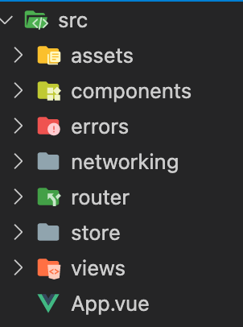

# Medical-Devices-WebApp

<!-- TABLE OF CONTENTS -->
<details open="open">
  <summary>Table of Contents</summary>
  <ol>
    <li>
      <a href="#overview">Overview</a>
      <ul>
        <li><a href="#technologies-and-frameworks">Technologies and Frameworks</a></li>
      </ul>
    </li>
    <li>
      <a href="#project-setup">Project Setup</a>
      <ul>
        <li><a href="#installation">Installation</a></li>
        <li><a href="#compiles-and-hot-reloads-for-development">Compiles and hot-reloads for development</a></li>
      </ul>
    </li>
    <li>
    	<a href="#development-overview">Development Overview</a>
        <ul>
        	<li><a href="#software-architecture">Software Architecture</a></li>
            <li><a href="#folder-structure">Folder Structure</a></li>
        </ul>
    </li>
    <li><a href="#area-for-improvement">Area for improvement</a></li>
  </ol>
</details>

<!-- ABOUT THE PROJECT -->

## Overview

This project is developed for the purpose of technical assessment in [Bitfountain.co](http://bitfountain.co/) for the position of Software Engineer.
The project is developed with Vue.js framework and [Flux](https://facebook.github.io/flux/) is used as software architecture.

### Technologies and Frameworks

- [Vue.js](https://vuejs.org/)
- [Vuex](https://vuex.vuejs.org/)
- [BootstrapVue](https://bootstrap-vue.org/)
- Programming Language: TypeScript
- Tested with: Google Chrome

## Project setup

### Installation

- Clone the project
  ```
  git clone https://github.com/tajirhas9/Medical-Devices-WebApp.git
  ```
- Go to project directory.
- install dependencies
  ```
  npm install
  ```

### Compiles and hot-reloads for development

```
npm run serve
```

## Development Overview

### Software Architecture

Software architecture used for this project is [Flux](https://facebook.github.io/flux/). Flux is developed by Facebook as an alternative solution to the problems that exist in current MVC implementation. For applications that need responsive UI, Flux architecture is proven to be more effective than MVC, also it ensures one way data binding, so no state update directly occurs from the view that makes the codebase more maintainable and reduces UI dependencies.

For implementing Flux architecture, Vue.js has recommended package [Vuex](https://vuex.vuejs.org/) that is used in the project.

Currently, the data flow in the app works as follows:

- Store is the single source of truth in the application.
- On any event trigger, that needs state update, an action is dispatched from the view.
- That action processes the task first i.e. any asynchronous network call is made in this action.
- After executing any backend api call or logical process needed for the state update, the action method commits a mutation.
- That mutation is responsible for any kind of update in the store.
- We can access the data in the store directly in the UI or by getter methods.


So, we can see that, the view can only read data from the store. It cannot directly update or manipulate data inside the store. The view needs to dispatch an action, that commits a mutation to the store.

This is the overall architecture that is used in the application.

### Folder Structure


For maintaining clean code and keeping future changes in mind that may occur in an application, I have broken down the codes in 6 separate folders. 
1. components
2. errors
3. networking
4. router
5. store
6. views

Now, let us break down each of these folders and understand what is going on inside those folders.

- **components**
  - This folder holds the custom build components that can be used as a common component in any view _i.e._ `nav-bar.vue` or simply isolating components from their corresponding views so that we can keep L.O.C as less as possible in a single file.
- **errors**
  - This folder generalizes error responses that come from the API.
    - **Reason for this folder:** The error responses in the backend do not maintain a general format. so, when we throw an error from the networking script to the action method of the vuex store, the vuex action method should not have any concern about the type of the error it receives. That is why, I have built a base error type that is common for any kind of error the vuex store may receive. It keeps the type defination same for any kind of error the store may get and reduces dependencies between scripts.
- **networking**
  - All the API calls are implemented here.
  - Two sub-folders are created depending on the type of api calls
    - **UserService** class maintains the api calls for user authentication and user info
    - **DeviceService** class maintains the api calls related to the REST operation on the devices.
- **router**
  - maintains navigation between views. built in vue-router.
- **store**
  - This folder holds all the scripts related to Vuex. The store is divided into two seperate modules. One for user and another for devices. The corresponding modules hold all the methods, getters,mutations, actions related to them.
- **views**
  - Holds the existing two view components of the app.

### Area for improvement

- The mutations are not properly typed in the vuex store. It may be solved by making the strings as enums for the mutations.
- Currently, the application validates token by existance of token or by receiving any Unauthorized error response from the api. It can be changed by checking token expiration before sending api calls. For that, the token_expiration response string received '24h' may be needed to be processed.
- Improvement in the UX/UI of the application
- The application can have a validation on the add new device input fields. For example, should not post request on empty input field. Currently, I don't know the validation requirement of that api so did not implement that. But it can be done in no time.
- More error types may be introduced.
